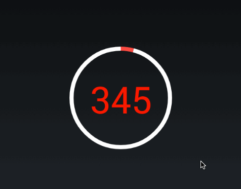

# CountDownProgress

### What is CountDownProgress

CountDownProgress is a widget used to display a count down progress when time passed. It's based on  [HoloCircularProgressBar](https://github.com/passsy/android-HoloCircularProgressBar)

## Usage

### Sample Project

You can see the ProgressBar working in the sample application. Just check out the library and create a new "Android Project form Existing Code"

### How to use 

Add to build.gradle

    me.biubiubiu.countdownprogress:library:1.0.0

Add the View in your Layout

    <de.passsy.holocircularprogressbar.HoloCircularProgressBar
        android:id="@+id/holoCircularProgressBar1"
        android:layout_width="wrap_content"
        android:layout_height="wrap_content"/>
  
### Screenshot

